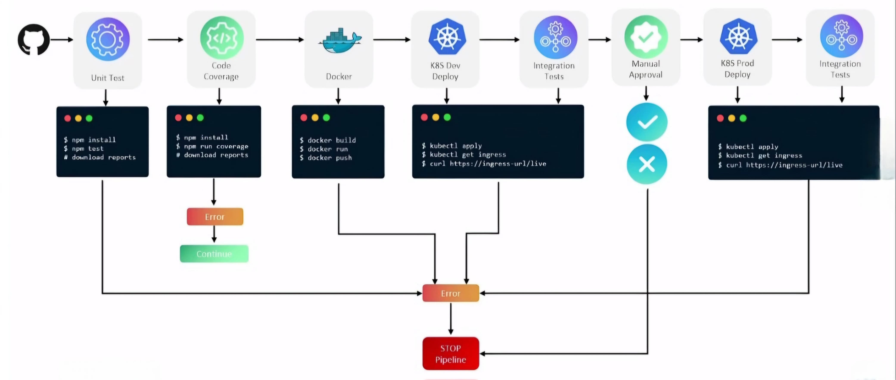

## Project Solar System - A NodeJS Based Web Application
A simple HTML+MongoDB+NodeJS project to display Solar System and it's planets.

## Requirements
For development, you will only need Node.js and NPM installed in your environement.

## Run Application in your local 
Clone the Code Repository `https://github.com/nirdeshkumar02/Project_Solar_System.git`.

Install Dependencies using `npm install`.

Run Unit Testing `npm test`.

Run Code Coverage `npm run coverage`.

Start Application Server `npm start`.

Access Application on Browser `http://localhost:3000/`.

## Changes Required
1. You need to provide the `**MongoDB Connection URL**` to connect the application with the database.
2. You have to create a collection named `**planets**` with some json.

## DevOps Pipeline
This project will be used to practicing CICD [Continuous Integration/Continuous Deployment/Continuous Delievery]. You can find all the steps which I'll performed as part of CICD in the attached images. 

